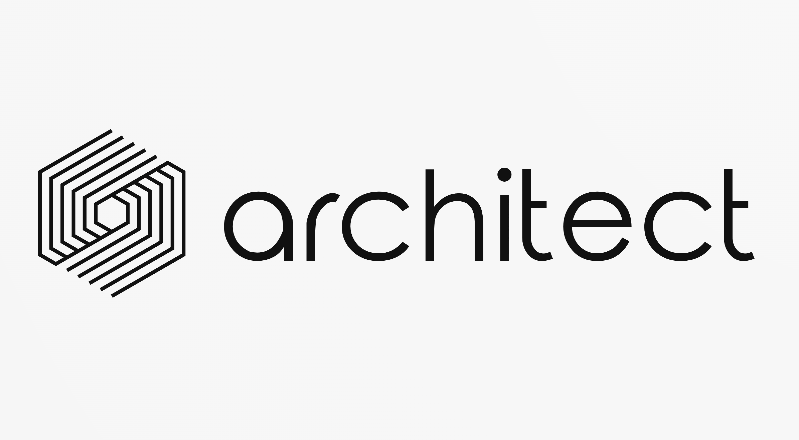

# Architect CLI

<p align="center">
  
</p>
**The software architect we all deserve.** Architect CLI enforces structure, consistency, and integrity across your codebase by embedding verifiable rules directly into your development workflow. Through opinionated, convention-over-configuration defaults and fully configurable templates, it delivers production-ready standards out of the box while allowing you to craft your own.

## Why Architect CLI?

* **Consistency & Integrity**: Automatically install and verify Git hooks to enforce commit conventions and code standards on every change.
* **Opinionated, Yet Configurable**: Comes with sensible defaults and multiple hook templates; override or extend with your own resources.
* **Convention over Configuration**: Get started immediately with production-ready settings; customize only what you need.
* **Plugin-Driven Phases**: Define and automate every phase of your architecture process — from init and verify to build, test, run, and release.

---

## Key Features

* **Multi-Phase Workflows**: Support for init, build, verify, test, run, and release phases, each pluggable and customizable.
* **Hooks Management**: Automatically install, update, and verify Git hooks to enforce policies on commit, merge, and push operations.
* **Release Management**: Integrate with Semantic Release for automated versioning, changelog generation, and GitHub Releases assets upload.
* **Commits Enforcement**: Enforce Conventional Commits or custom commit message rules via commit-msg hooks or CI checks.
* **Gradle Project Support**: Native support for Kotlin/Gradle projects, including dependency resolution and build orchestration.
* **Pipeline Templating**: Provide and manage opinionated CI/CD pipeline templates; scaffold and validate pipeline configurations.
* **Scripts Management**: Bundle and execute helper scripts from resources without manual copying.

---

## Installation

### Build from Source

```bash
git clone https://github.com/alemazzo/architect.git
cd architect
./gradlew shadowJar
```

Run any phase:

```bash
java -jar architect-cli/build/libs/architect-cli-*-all.jar init
```

### One‑Line Installer Script

```bash
curl -sSL https://raw.githubusercontent.com/alemazzo/architect/main/.installers/bash | bash
```

This installer:

1. Downloads the latest JAR into `~/.architect/architect.jar`.
2. Creates an `architect` executable wrapper in `~/.architect/`.
3. Adds `~/.architect` to your `PATH` for seamless CLI access.

Run:

```bash
architect init
```

### Local Development Mode

```bash
architect --local init
```

Rebuilds and reinjects your local changes without a fresh download.

### CI Installation Mode

For non-interactive CI environments (e.g., GitHub Actions), use the CI installer script:

```bash
curl -sSL https://raw.githubusercontent.com/alemazzo/architect/main/.installers/bash-ci | bash
```

This installs the CLI into `$HOME/.architect` and adds it to the `PATH` for the duration of the CI job without modifying shell profiles.

---

## Usage

The `architect` command delegates to **subcomponents** (phases or plugins), handling all registered subtasks automatically. Each subcomponent is accessible via:

```bash
architect <component> [subtask] [options]
```

* `<component>`: a core phase or plugin name (e.g., `init`, `verify`, `build`, `test`, `run`, `release`, `hooks`, `commits`, `pipeline`).
* `[subtask]`: an optional task under the component (e.g., `install`, `verify`, `pre-commit`, `commit-msg`). If omitted, it runs the default action for the component.

### Examples

* **Initialize** (default init phase):

  ```bash
  architect init
  ```
* **Verify Git hooks**:

  ```bash
  architect hooks verify
  ```
* **Install Git hooks**:

  ```bash
  architect hooks install
  ```
* **Enforce commit rules**:

  ```bash
  architect commits enforce
  ```
* **Trigger a specific build subtask** (e.g., clean, assemble):

  ```bash
  architect build clean
  architect build assemble
  ```
* **View help for any component**:

  ```bash
  architect <component> --help
  ```

### Common Options

* `--local`: Use locally built JAR instead of downloading.
* `-h`, `--help`: Show usage for the root command or a specific component.
* `-V`, `--version`: Show the CLI version.

---

## Extending Architect CLI

Add your own phases by implementing one of the phase interfaces (`Init`, `Verify`, `Build`, `Test`, `Run`, `Release`) and annotating with Picocli:

```kotlin
@Singleton
@Command(name = "audit", description = ["Run custom audit rules"])
class AuditPhase : Verify {
    override fun run() { /* enforce audit rules */ }
}
```

Micronaut DI and Picocli will auto-discover and wire your phase.

---

## Configuration

Place YAML files in your `.architect/` directory to customize behavior:

```yaml
# .architect/settings.yml
allowedCommitTypes:
  - feat
  - fix
  - chore
```

The CLI merges all `*.yml` and `*.yaml` files into a single `Context` object.

---

## Contributing

We follow **Conventional Commits** and **opinionated defaults**. Fork, branch off `main`, and open a PR with `feat:`, `fix:`, etc.

---

## License

MIT. See [LICENSE](LICENSE).
